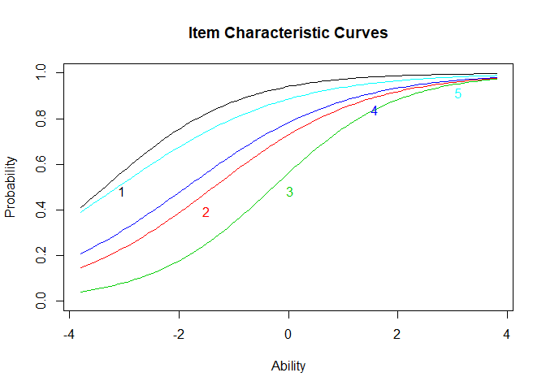
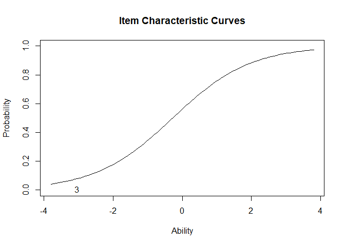
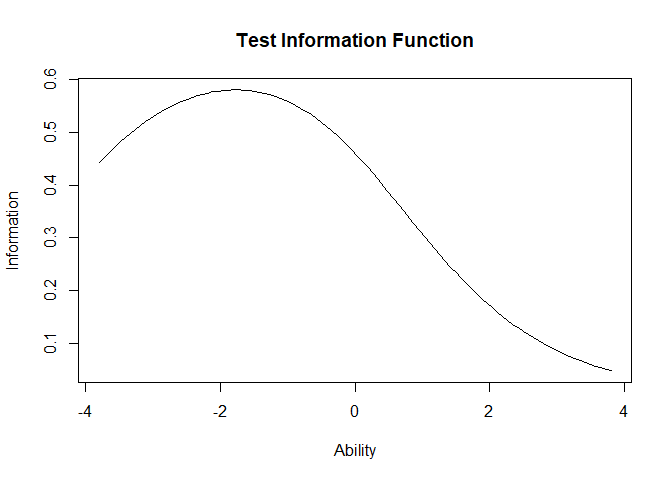

2PL and 3PL Dichotomous Item response theory models
================

Data
----

    ##   Item 1 Item 2 Item 3 Item 4 Item 5
    ## 1      0      0      0      0      0
    ## 2      0      0      0      0      0
    ## 3      0      0      0      0      0
    ## 4      0      0      0      0      1
    ## 5      0      0      0      0      1
    ## 6      0      0      0      0      1

The Law School Admission Test (LSAT), The LSAT is a classical example in educational testing for measuring ability traits. This test was designed to measure a single latent ability scale.

*Format*

A data frame with the responses of 1000 individuals to 5 questions.

*References*

Bartholomew, D., Steel, F., Moustaki, I. and Galbraith, J. (2002) The Analysis and Interpretation of Multivariate Data for Social Scientists. London: Chapman and Hall.

Libraries
---------

``` r
#library(ltm)
#library(mirt)
```

Model
-----

Logistic distribution:

``` r
IRTmodel <- ltm(LSAT~z1,IRT.param= TRUE)
```

Results
-------

``` r
IRTmodel <- ltm(LSAT~z1,IRT.param= TRUE)
summary(IRTmodel)
```

    ## 
    ## Call:
    ## ltm(formula = LSAT ~ z1, IRT.param = TRUE)
    ## 
    ## Model Summary:
    ##    log.Lik      AIC      BIC
    ##  -2466.653 4953.307 5002.384
    ## 
    ## Coefficients:
    ##                 value std.err  z.vals
    ## Dffclt.Item 1 -3.3597  0.8669 -3.8754
    ## Dffclt.Item 2 -1.3696  0.3073 -4.4565
    ## Dffclt.Item 3 -0.2799  0.0997 -2.8083
    ## Dffclt.Item 4 -1.8659  0.4341 -4.2982
    ## Dffclt.Item 5 -3.1236  0.8700 -3.5904
    ## Dscrmn.Item 1  0.8254  0.2581  3.1983
    ## Dscrmn.Item 2  0.7229  0.1867  3.8721
    ## Dscrmn.Item 3  0.8905  0.2326  3.8281
    ## Dscrmn.Item 4  0.6886  0.1852  3.7186
    ## Dscrmn.Item 5  0.6575  0.2100  3.1306
    ## 
    ## Integration:
    ## method: Gauss-Hermite
    ## quadrature points: 21 
    ## 
    ## Optimization:
    ## Convergence: 0 
    ## max(|grad|): 0.024 
    ## quasi-Newton: BFGS

``` r
coef(IRTmodel)
```

    ##            Dffclt    Dscrmn
    ## Item 1 -3.3597341 0.8253715
    ## Item 2 -1.3696497 0.7229499
    ## Item 3 -0.2798983 0.8904748
    ## Item 4 -1.8659189 0.6885502
    ## Item 5 -3.1235725 0.6574516

The Difficulty is analagous to *θ* and 'ability'. The figures are &lt;0 and in this respect the questions are 'easy'.

Discrimination describes how well the question discriminates ability; in this context a good discriminator would be &gt;1; these questions are poor discriminators.

Plots
-----

``` r
plot(IRTmodel, type="ICC")
```



S curves would be optimal but the tails are missing.

``` r
plot(IRTmodel, type ="ICC",items=3)
```



Curve 3 is the most representative of an S curve and this item is the best discrimator of ability.

``` r
plot(IRTmodel, type ="IIC",items=0)      
```



``` r
factor.scores(IRTmodel)
```

    ## 
    ## Call:
    ## ltm(formula = LSAT ~ z1, IRT.param = TRUE)
    ## 
    ## Scoring Method: Empirical Bayes
    ## 
    ## Factor-Scores for observed response patterns:
    ##    Item 1 Item 2 Item 3 Item 4 Item 5 Obs     Exp     z1 se.z1
    ## 1       0      0      0      0      0   3   2.277 -1.895 0.795
    ## 2       0      0      0      0      1   6   5.861 -1.479 0.796
    ## 3       0      0      0      1      0   2   2.596 -1.460 0.796
    ## 4       0      0      0      1      1  11   8.942 -1.041 0.800
    ## 5       0      0      1      0      0   1   0.696 -1.331 0.797
    ## 6       0      0      1      0      1   1   2.614 -0.911 0.802
    ## 7       0      0      1      1      0   3   1.179 -0.891 0.803
    ## 8       0      0      1      1      1   4   5.955 -0.463 0.812
    ## 9       0      1      0      0      0   1   1.840 -1.438 0.796
    ## 10      0      1      0      0      1   8   6.431 -1.019 0.801
    ## 11      0      1      0      1      1  16  13.577 -0.573 0.809
    ## 12      0      1      1      0      1   3   4.370 -0.441 0.813
    ## 13      0      1      1      1      0   2   2.000 -0.420 0.813
    ## 14      0      1      1      1      1  15  13.920  0.023 0.828
    ## 15      1      0      0      0      0  10   9.480 -1.373 0.797
    ## 16      1      0      0      0      1  29  34.616 -0.953 0.802
    ## 17      1      0      0      1      0  14  15.590 -0.933 0.802
    ## 18      1      0      0      1      1  81  76.562 -0.506 0.811
    ## 19      1      0      1      0      0   3   4.659 -0.803 0.804
    ## 20      1      0      1      0      1  28  24.989 -0.373 0.815
    ## 21      1      0      1      1      0  15  11.463 -0.352 0.815
    ## 22      1      0      1      1      1  80  83.541  0.093 0.831
    ## 23      1      1      0      0      0  16  11.254 -0.911 0.802
    ## 24      1      1      0      0      1  56  56.105 -0.483 0.812
    ## 25      1      1      0      1      0  21  25.646 -0.463 0.812
    ## 26      1      1      0      1      1 173 173.310 -0.022 0.827
    ## 27      1      1      1      0      0  11   8.445 -0.329 0.816
    ## 28      1      1      1      0      1  61  62.520  0.117 0.832
    ## 29      1      1      1      1      0  28  29.127  0.139 0.833
    ## 30      1      1      1      1      1 298 296.693  0.606 0.855

Empirical Bayes scoring

Where z1 is the predicted ability based on the pattern of scores. Most common combination is to get them all right (298), questions are too easy.

3PL
===

``` r
IRTmodel_guess=tpm(LSAT,type="latent.trait",IRT.param = TRUE)
```

``` r
factor.scores(IRTmodel_guess)
```

    ## 
    ## Call:
    ## tpm(data = LSAT, type = "latent.trait", IRT.param = TRUE)
    ## 
    ## Scoring Method: Empirical Bayes
    ## 
    ## Factor-Scores for observed response patterns:
    ##    Item 1 Item 2 Item 3 Item 4 Item 5 Obs     Exp     z1 se.z1
    ## 1       0      0      0      0      0   3   2.230 -1.871 0.790
    ## 2       0      0      0      0      1   6   5.820 -1.463 0.792
    ## 3       0      0      0      1      0   2   2.583 -1.446 0.793
    ## 4       0      0      0      1      1  11   8.944 -1.032 0.796
    ## 5       0      0      1      0      0   1   0.701 -1.325 0.796
    ## 6       0      0      1      0      1   1   2.628 -0.908 0.800
    ## 7       0      0      1      1      0   3   1.185 -0.889 0.801
    ## 8       0      0      1      1      1   4   5.969 -0.463 0.809
    ## 9       0      1      0      0      0   1   1.855 -1.438 0.801
    ## 10      0      1      0      0      1   8   6.456 -1.017 0.803
    ## 11      0      1      0      1      1  16  13.583 -0.570 0.810
    ## 12      0      1      1      0      1   3   4.374 -0.439 0.814
    ## 13      0      1      1      1      0   2   2.002 -0.418 0.815
    ## 14      0      1      1      1      1  15  13.906  0.028 0.829
    ## 15      1      0      0      0      0  10   9.438 -1.358 0.791
    ## 16      1      0      0      0      1  29  34.655 -0.945 0.796
    ## 17      1      0      0      1      0  14  15.612 -0.926 0.797
    ## 18      1      0      0      1      1  81  76.691 -0.504 0.806
    ## 19      1      0      1      0      0   3   4.684 -0.801 0.800
    ## 20      1      0      1      0      1  28  25.037 -0.375 0.810
    ## 21      1      0      1      1      0  15  11.481 -0.354 0.811
    ## 22      1      0      1      1      1  80  83.338  0.089 0.827
    ## 23      1      1      0      0      0  16  11.294 -0.909 0.803
    ## 24      1      1      0      0      1  56  56.131 -0.481 0.811
    ## 25      1      1      0      1      0  21  25.652 -0.460 0.812
    ## 26      1      1      0      1      1 173 173.188 -0.018 0.825
    ## 27      1      1      1      0      0  11   8.446 -0.329 0.816
    ## 28      1      1      1      0      1  61  62.389  0.119 0.831
    ## 29      1      1      1      1      0  28  29.073  0.142 0.832
    ## 30      1      1      1      1      1 298 296.893  0.612 0.853

``` r
anova(IRTmodel,IRTmodel_guess)  
```

    ## Warning in anova.ltm(IRTmodel, IRTmodel_guess): either the two models are not nested or the model represented by 'object2' fell on a local maxima.

    ## 
    ##  Likelihood Ratio Table
    ##                    AIC     BIC  log.Lik   LRT df p.value
    ## IRTmodel       4953.31 5002.38 -2466.65                 
    ## IRTmodel_guess 4963.32 5036.94 -2466.66 -0.01  5       1

Addition of guessing parameter does not improve the model,illustrated by log likelihood.
There is no significant variance between 2PL and 3PL.

------------------------------------------------------------------------
